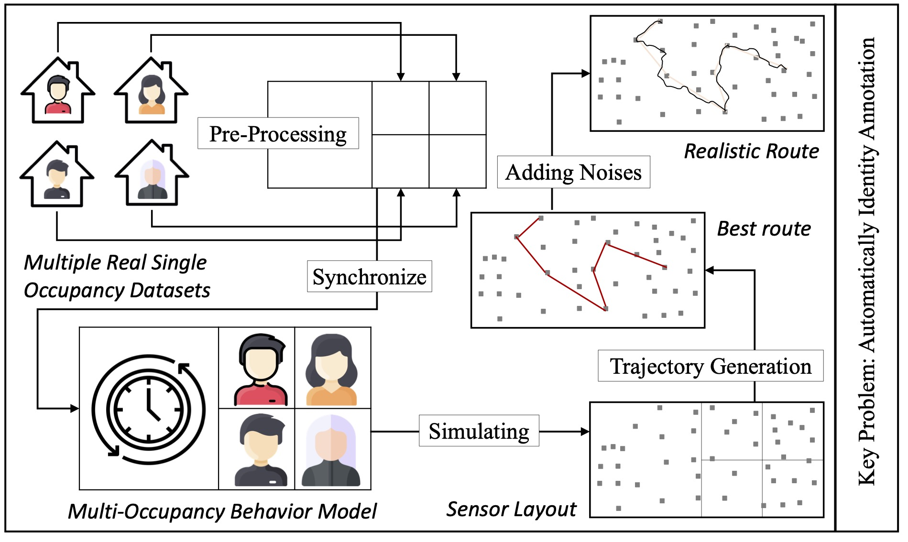

# MoSen

Simulation Environment: MATLAB

## Step One | Visualization of Multi-Occupancy Trajectories

Run "0_local_main.m"

---

#### Input:
##### 1. 01_floorplan.jpg: the floorplan of the target smart home;
##### 2. 02_sensor_loc.txt: the proposed sensor layout in the target smart home, i.e., the (x, y) readings of each sensor;
##### 3. 03_path.txt: the list of all bridge connections among sensor nodes;
##### 4. 04_trajectory_data.txt: multi-resident trajectories

-------

#### Output:
##### path.gif: visualization of trajectory_data.txt with the specified floorplan and sensor layout

## Step Two
